# tdk-import

Scan a repo and import the services it describes into [TDK](https://github.com/tdk-landscape/tdk-cli-core) as bring-your-own `service.json` files. Part of tdk-landscape/tdk-cli-core#511; the Procfile detector is tdk-landscape/tdk-cli-core#520.

```bash
npx tdk-import . --dry-run     # plan only
npx tdk-import . --yes         # write services/<stack>/<name>/service.json
```



The animation shows a three-line Procfile (`web`, `worker`, `release`) imported, then run through `tdk project --yes`, `tdk config regenerate` and `tdk up` (tdk 1.3.86). Every file listed was produced in that run, including the `.autogenerated` folders that `tdk up` writes. Today `tdk up` then stops at the build, because a Procfile carries no image or Dockerfile (see Status).

It reads `Procfile`, `docker-compose*.yml`, `Dockerfile` and `package.json`, merges what several files say about one service, lists conflicts instead of guessing, and never overwrites a `service.json` without `--force`. See [docs/import.md](docs/import.md) for what maps, what is skipped, and how to add a detector, and `openspec/changes/import-repo/` for the spec.

Status: not yet published to npm. Checked through a real `tdk up` (tdk 1.3.86): the manifests are discovered and `.autogenerated` is generated, but the build fails. A Procfile-only service has no image or Dockerfile ("CUSTOM DOCKERFILE NOT FOUND"), and an imported Dockerfile outside the manifest folder cannot `COPY` source files, because TDK builds with the manifest folder as context. Tracked in the issues of this repo.

```bash
bun install && bun run build && bun run test
```
